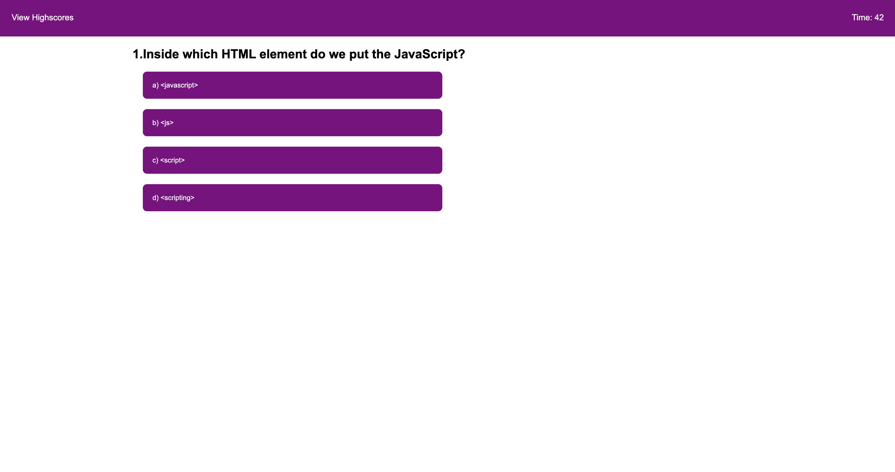

# Quiz-Form
Javascript quiz 

Purpose of this quiz is to test your knowledge of javascript through a series of multiple choice questions.

10 seconds will be deducted each time you answer a question incorrectly, and you will have a total of 50 seconds to answer 5 questions.

At the end of the quiz, you will have the choice to add your project to an ordered leaderboard.

Deployed Application is live [here](https://splitrabbit.github.io/Quiz-Form/) .

Screenshot: 